<div align="center">


# 『从0开始构建 AI 智能体』

**一本带你亲手打造类 “Claw” AI Agent 的实战书**

[](https://www.python.org/) [](https://github.com/astral-sh/uv) [](https://openai.com) [](LICENSE) [](https://github.com/hyyhf/agent-book-code)

*从第一个 LLM API 调用开始，一层一层搭出真正能工作的 AI 智能体*

<br/>

> **News：** FunHarness Studio v0.1.0 已发布！免安装便携版 / 安装包均可下载 → [**Download**](https://github.com/hyyhf/agent-book-code/releases/tag/v0.1.0)（暂支持 Windows 系统）

<h2>FunHarness：从终端到图形化教学工作台</h2>

<div style="display:flex; gap:10px; align-items:flex-start; justify-content:center;">
  <div style="width:50%; text-align:center;">
    <a href="#命令参考">
      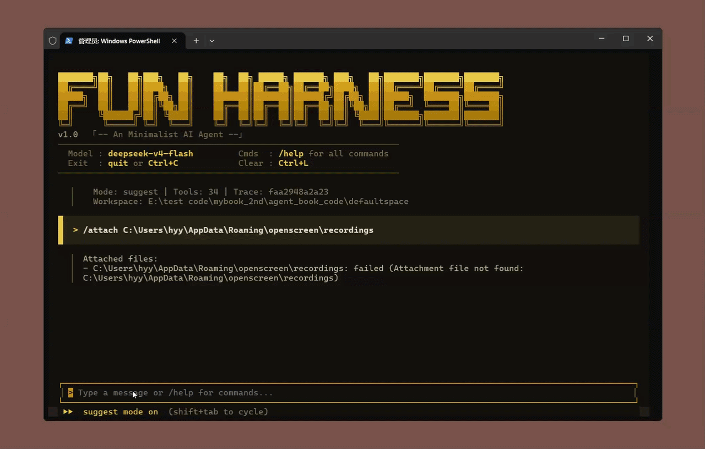
    </a>
    <sub><b>FunHarness TUI</b><br/>终端界面，命令行交互</sub>
  </div>
  <div style="width:50%; text-align:center;">
    <a href="docs/funharness_studio.zh.md">
      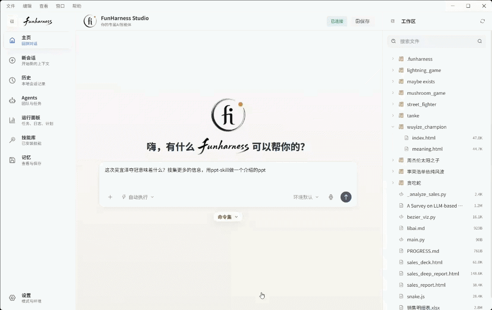
    </a>
    <sub><b>FunHarness Studio</b><br/>为学生打造的本地化Agent GUI，打开就能上手</sub>
  </div>
</div>

</div>

---

<div align="center">

</div>

## 封面

<div align="center">
  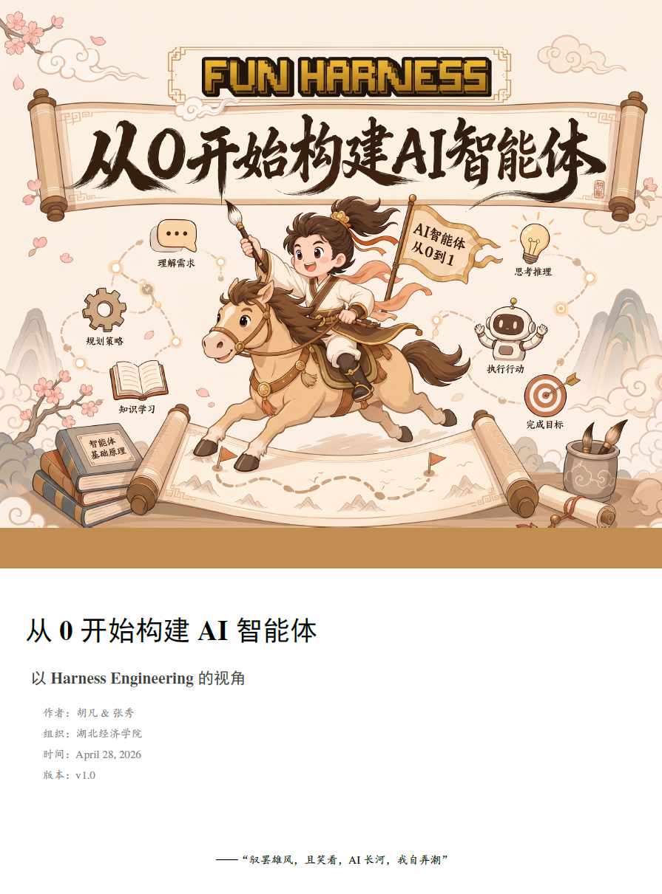
</div>

> 真正理解 Agent 的方式，不是只使用 Agent，而是亲手把它构建出来。


## 目录预览

<div align="center">
  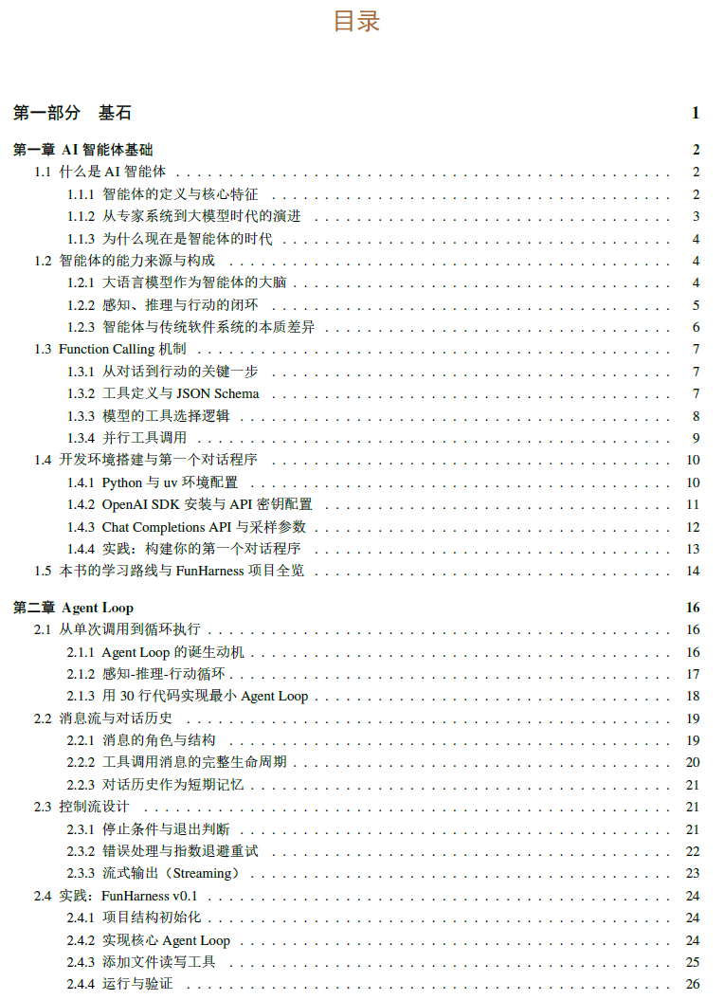
  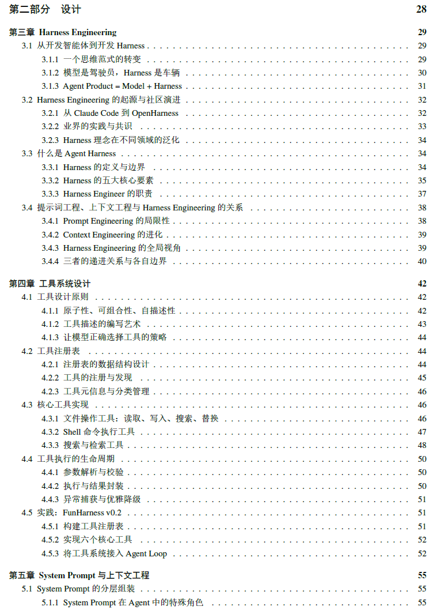
  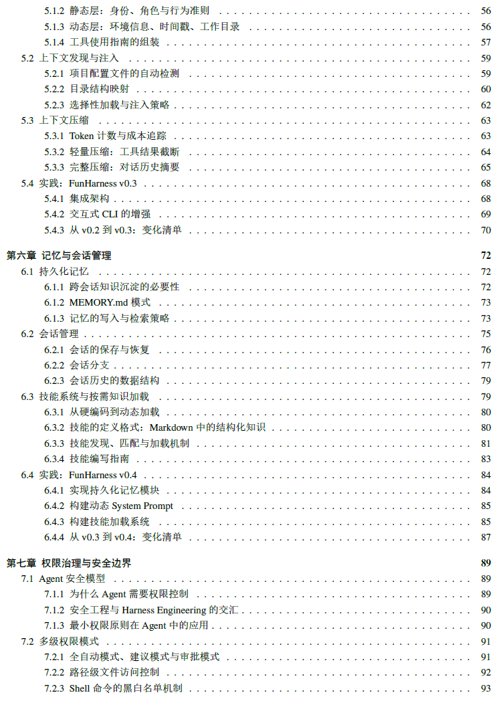
  <br/>
  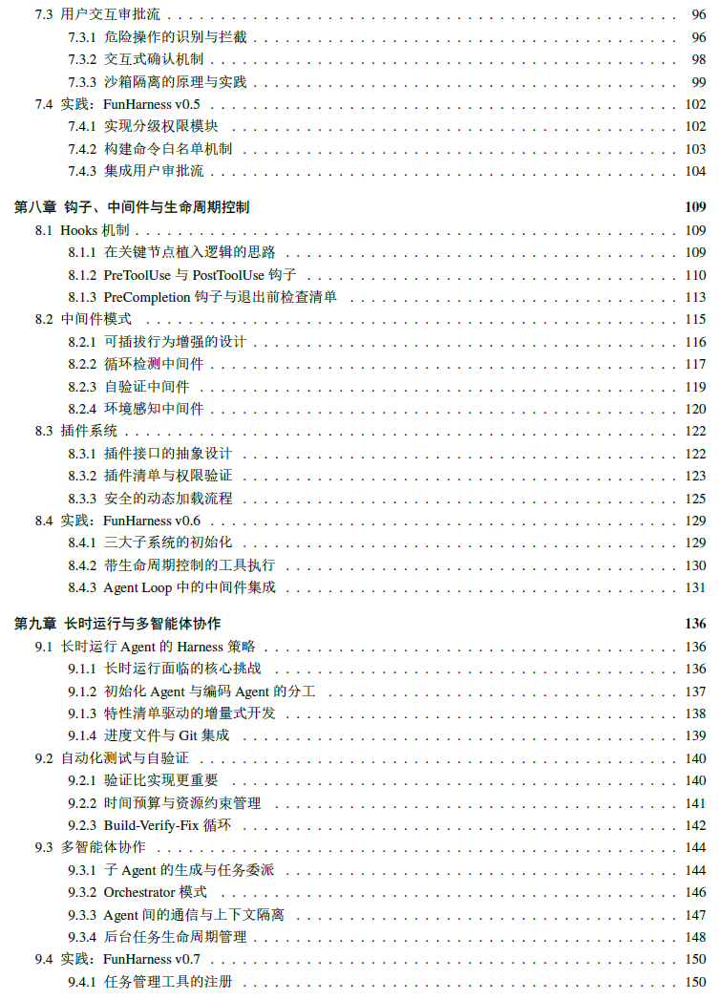
  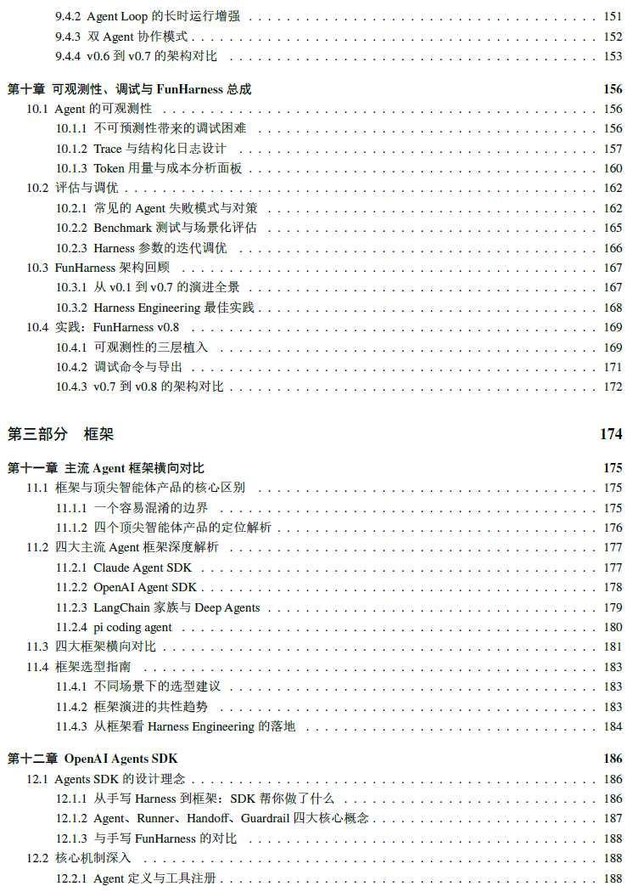
  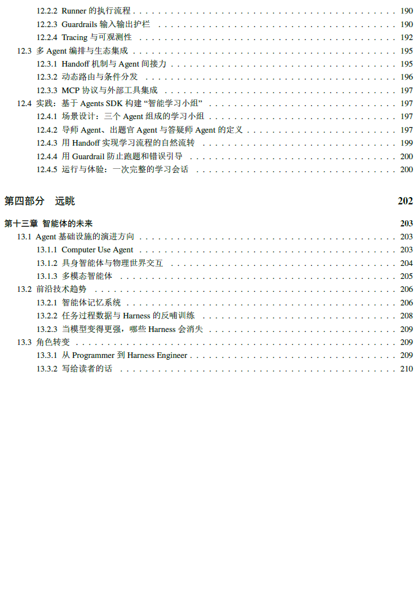
</div>

<div align="center"></div>

## 关于本书

本书是一本**从零开始构建 AI 智能体**的实战教材。不依赖任何高层 Agent 框架，完全基于原始 LLM API，带领读者一步一步手写出一个具备工具调用、上下文管理、权限控制、可观测性的 AI 编程助手**FunHarness**。

它不是一本只展示 API 调用片段的教程，也不是一本只讲概念的 Agent 读物。本书更像一条可运行、可拆解、可复现的工程路线：先从一次最小 LLM 调用开始，理解消息、流式输出和函数调用；再逐步加入 Agent Loop、工具系统、上下文管理、记忆、权限、Hooks、多 Agent 协作与可观测性；最后把这些能力沉淀进一个完整的 mini 产品。

这也是本书与普通示例代码最大的区别：读者不是“看完一个项目”，而是跟着项目的演进过程，亲手把一个类 **“Claw” AI Agent** 搭出来。每一章都有对应的中间版本，每一次新增能力都能被运行、对比和修改。到最后，FunHarness 不只是代码仓库里的产物，而是读者理解 Agent 工程化之后的第一个实战作品。

> [!tip]
> 本书的核心信念：**理解 > 使用**。
> 真正掌握 Agent 原理的最佳方式，是亲手把每一层抽象从零实现一遍。


<div align="center">

`──────  从原理到产品，从示例到自己的 Agent  ──────`

</div>

### 目标读者

- 想深入理解 LLM Agent 工作原理，而不只是调用现成框架的开发者
- 正在构建自己的 AI 工具链、编程助手或自动化 Agent 的工程师
- 对 Claude Code、Cursor、OpenDevin、类 “Claw” AI Agent 等 AI 编程工具感兴趣，想了解其内部机制的技术人员
- 希望通过一个可运行 mini 产品练习 Agent 工程化设计的读者

### 本书特色

| 特色              | 说明                                                                                  |
| ----------------- | ------------------------------------------------------------------------------------- |
| **从零构建**      | 每一章都从最基础的概念出发，不跳步骤                                                  |
| **迭代演进**      | FunHarness 从 `v01` 到 `v08` 逐版本进化，读者可以看到每个特性如何被加入、为什么要加入 |
| **可运行代码**    | 每章均有独立可运行的示例，以及对应版本的 FunHarness                                   |
| **mini 产品实战** | 最终产物 FunHarness 是一个真实可用、配置简单、便于教学和试验的 AI 编程助手            |
| **读者可复刻**    | 所有读者都可以在本仓库基础上继续改造，打造属于自己的类 “Claw” AI Agent                |
| **原理优先**      | 在引入第三方库之前，先手写核心机制，确保读者真正理解底层                              |

<div align="center"></div>

## 内容结构与章节代码

本仓库共 **11 章**代码，每章包含若干独立示例脚本和对应版本的 FunHarness 主体。

| 章节           | 主题                                      | 关键脚本                                                                                                     | 运行方式                                 |
| -------------- | ----------------------------------------- | ------------------------------------------------------------------------------------------------------------ | ---------------------------------------- |
| **Chapter 01** | LLM 基础：API 调用与流式输出              | `first_chat.py` `streaming_demo.py` `function_calling.py` `multi_turn_chat.py` `sampling_params.py`          | `uv run chapter01/first_chat.py`         |
| **Chapter 02** | Agent Loop：从无到有的智能体循环          | `minimal_agent_loop.py` `streaming_agent.py` `message_lifecycle.py` `error_retry.py` **`funharness_v01.py`** | `uv run chapter02/minimal_agent_loop.py` |
| **Chapter 03** | Harness 框架：裸 Agent vs. 有框架 Agent   | `bare_vs_harnessed.py` `harness_anatomy.py` `prompt_context_harness.py`                                      | `uv run chapter03/bare_vs_harnessed.py`  |
| **Chapter 04** | 工具系统：注册、调用到生命周期            | `tool_registry.py` `tool_lifecycle.py` `tool_design_principles.py` `core_tools.py` **`funharness_v02.py`**   | `uv run chapter04/tool_registry.py`      |
| **Chapter 05** | 上下文管理：发现、压缩与系统提示          | `context_discovery.py` `context_compaction.py` `system_prompt_builder.py` **`funharness_v03.py`**            | `uv run chapter05/context_discovery.py`  |
| **Chapter 06** | 记忆、技能与会话：跨轮次的状态持久化      | `persistent_memory.py` `skill_loader.py` `session_manager.py` **`funharness_v04.py`**                        | `uv run chapter06/persistent_memory.py`  |
| **Chapter 07** | 权限系统：auto / suggest / approve 三模式 | `permission_manager.py` `approval_flow.py` **`funharness_v05.py`**                                           | `uv run chapter07/permission_manager.py` |
| **Chapter 08** | Hooks、Middleware 与插件架构              | `hooks.py` `middleware.py` `plugin_system.py` **`funharness_v06.py`**                                        | `uv run chapter08/hooks.py`              |
| **Chapter 09** | 多任务与多智能体协作                      | `task_manager.py` `multi_agent.py` `build_verify_fix.py` **`funharness_v07.py`**                             | `uv run chapter09/task_manager.py`       |
| **Chapter 10** | 可观测性与评估：追踪、日志与成本看板      | `observability.py` `evaluation.py` **`funharness_v08.py`**                                                   | `uv run chapter10/observability.py`      |
| **Chapter 12** | OpenAI Agents SDK：框架对比与实战         | `01_basic_agent.py` `02_handoff.py` `03_guardrails.py` `04_tracing.py` `05_study_group.py`                   | `uv run chapter12/01_basic_agent.py`     |

> [!tip]
> **说明**：每章中加粗的 `funharness_vXX.py` 是该章对应版本的 FunHarness 完整实现，可独立运行。最终的完整版本即本仓库的 [`funharness/`](./funharness/) 目录。

### 环境准备

1. **安装包管理器 uv**

本项目使用 [uv](https://github.com/astral-sh/uv) 作为包和环境管理器。如果你尚未安装，可以使用以下命令：

```bash
# macOS / Linux
curl -LsSf https://astral.sh/uv/install.sh | sh

# Windows (PowerShell)
powershell -ExecutionPolicy ByPass -c "irm https://astral.sh/uv/install.ps1 | iex"
```

> 更多安装方式请参考 [uv 官方安装文档](https://docs.astral.sh/uv/getting-started/installation/)。

2. **克隆仓库与安装依赖**

```bash
# 克隆仓库
git clone https://github.com/your-org/agent-book-code.git
cd agent-book-code

# 安装依赖（使用 uv）
uv sync

# 配置环境变量
cp .env.example .env
# 编辑 .env，填入 OPENAI_API_KEY 和 OPENAI_MODEL_NAME
```

`.env` 最小配置：

```bash
OPENAI_API_KEY=your_api_key_here
OPENAI_MODEL_NAME=deepseek-v4-flash # 可选：使用自定义 API base（兼容 OpenAI 格式的任意服务商）
OPENAI_BASE_URL=https://api.deepseek.com/v1
```

运行任意章节示例：

```bash
uv run chapter01/first_chat.py
uv run chapter04/tool_registry.py
uv run chapter09/multi_agent.py
```


## 本书出版计划

本书目前正在计划出版中。等正式出版后，会将电子版完整书籍上传到本仓库并开放分享，方便大家结合章节代码一起阅读、运行和实践。

如果你正在关注 AI Agent、编程助手或类 “Claw” Agent 的实现方式，可以先从本仓库的代码和 FunHarness 项目开始体验，也欢迎持续关注后续正式书稿。

<div align="center"></div>

---

## FunHarness —— 本书的配套项目

<div align="center">

</div>

<div align="center">
 <b>&</b> 


[](#) [](https://github.com/Textualize/textual) [](#功能更新) [](./docs/feishu_channel.zh.md) [](#工具系统) [](#权限系统)

</div>

FunHarness 是本书的**核心实战项目**，也是贯穿全书的主线。它是一个用于教学、试验和二次改造的 **minimal AI Agent 产品**：足够小，小到读者可以读完关键代码；足够完整，完整到它真的能在本地运行、调用工具、管理上下文、保存记忆、追踪任务，并通过 TUI 或机器人通道与用户交互。

FunHarness 基于Claude Code核心思想，但不是把复杂系统直接搬给读者，而是把一个 AI Agent 产品拆成可学习的工程组件：Agent Loop 负责推理与推进，Tool 负责能力边界，Context 管理负责长对话，Permission 负责安全约束，Hooks/Middleware 负责扩展，可观测性负责调试和复盘。读者能清楚看到一个会做事的 Agent 是怎样从几十行代码长出来的。

更重要的是，FunHarness 是本书内容的**升华和进一步实战**。前面的章节讲原理、拆机制、写小例子；FunHarness 则把这些知识重新装配成一个可用产品。它既可以作为课程演示项目，也可以作为个人试验台，还可以作为读者打造自己类 **“Claw” AI Agent** 的起点。

 **[FunHarness Studio](docs/funharness_studio.zh.md)** 是 FunHarness 的本地化 GUI 形态：它不替代 TUI，而是与 TUI 共享同一个 Agent Core，把命令行里的工具调用、任务图、附件、会话、权限与可观测性做成更直观的可视化操作台。Studio 完全围绕学生群体设计，目标是“打开就会用、边用边理解 Agent 怎么工作”，因此特别适合课堂教学、实验课演示和课后自学：学生可以在界面中观察工具调用过程、回放历史会话、管理工作区文件、查看任务拆解与后台执行状态，也可以在不熟悉命令的情况下完成本地 Agent 实验。

> [!tip]
> **FunHarness = 一个你自己能读懂、改得动的 Claude Code**
> - 一个面向学习和实验的 mini Claude Code / OpenClaw 风格 AI Agent。
> - 它不追求功能最全，而是追求每一行代码都能讲清楚、每一个能力都能被复刻。这正是“从零构建”的意义。
> - 它有 TUI，也有面向学生的 FunHarness Studio 本地 GUI：TUI 适合理解命令和底层交互，Studio 适合课堂展示、可视化观察和零门槛上手。
> - 它有工具调用，有权限，有上下文压缩，有记忆，有任务系统，有可观测性，还有飞书机器人通道。更重要的是，这些能力不是黑盒塞给你的，而是沿着本书章节逐步演化出来的。读者可以跟着书一起从 `funharness_v01.py` 写到完整的 `funharness/`，最终打造出属于自己的类 “Claw” AI Agent。

### 为什么说它适合教学和试验

| 特点             | 说明                                                                                                                 |
| ---------------- | -------------------------------------------------------------------------------------------------------------------- |
| **教学优先**     | 每个模块都尽量直接、清晰、可读，适合学习 agent 基础设施                                                              |
| **配置简单**     | 只需要 Python、uv 和一个兼容 OpenAI 格式的模型配置，本地即可启动，不需要复杂服务编排                                 |
| **结构克制**     | 不引入庞大的 Agent 框架，核心模块边界清楚，适合逐文件阅读                                                            |
| **版本可对照**   | `funharness_v01` 到 `funharness_v08` 展示了从最小 Loop 到完整产品的演进路径,每个版本都对应书中一个阶段，方便对比学习 |
| **能力可拆装**   | 工具、记忆、技能、权限、Hooks、任务、可观测性都可以单独理解和替换                                                    |
| **真实可运行**   | 不是伪代码或玩具 demo，而是一个能处理本地文件、命令、任务和会话的 mini 产品                                          |
| **类 Claw 体验** | 支持本地工具执行、文件修改、命令运行、外部聊天入口                                                                   |
| **适合再创造**   | 读者可以保留核心框架，替换工具、提示词、权限策略和交互界面，做出自己的 Agent                                         |

### 与本书的关系

FunHarness 在全书中**分 8 个版本逐步演化**：

```
Chapter 02  funharness_v01  最小 Agent Loop（无工具）
Chapter 04  funharness_v02  + 工具注册与调用
Chapter 05  funharness_v03  + 上下文管理与系统提示
Chapter 06  funharness_v04  + 记忆、技能、会话持久化
Chapter 07  funharness_v05  + 权限系统（三模式）
Chapter 08  funharness_v06  + Hooks / Middleware / 插件
Chapter 09  funharness_v07  + 任务规划与多智能体
Chapter 10  funharness_v08  + 可观测性、追踪、成本看板
              |
              v
funharness/   完整生产版本（TUI + 飞书通道）
```

读者可以将每章的 `funharness_vXX.py` 与下一章的版本对比，精确看到每个特性被加入的那一刻。

本书前半部分是在拆解 Agent 的“零件”，FunHarness 则是在带读者完成一次整机装配。当你理解了每个版本为什么变化，就不只是会运行 FunHarness，而是具备了继续扩展它、裁剪它、重写它的能力。

---

### 功能更新

> [!NOTE] 
> - **2026-05-19 —— 新增桌面宠物功能：**
>   - 左侧导航栏新增「宠物」面板，可从 [Petdex 社区精选图鉴](https://petdex.crafter.run/zh) 添加像素宠物，也可上传自定义 Sprite Sheet。
>   - 宠物以动画形式悬浮在界面角落，根据 Agent 运行状态（启动、思考、工具调用、完成、失败、审批等）自动切换动作。
>   - 支持显示开关、位置（左下 / 右下）、大小（小 / 中 / 大）等偏好设置，配置持久化到工作目录 `pets/` 文件夹。
> - **2026-05-16 —— 新增 QQ 机器人 & 微信机器人通道：**
>   - 新增 QQ 机器人通道（基于 `qqbot-agent-sdk`，WebSocket 网关，支持 C2C、文件收发）。
>   - 新增微信机器人通道（基于 `openclaw-weixin` 协议，扫码登录 + getUpdates 长轮询，文本消息收发）。
>   - FunHarness 现已支持 ** 飞书 / QQ / 微信** 五种输入通道，共享同一套 Agent Core。
> - **2026-05-06 —— TUI 能力补齐与修复：**
>   - TUI 新增附件管理、慢命令后台执行、Skills/附件专用展示；修复工具结果回调、流式元数据、Skills frontmatter 与 Web Search 展示等问题。
> - **2026-05-05 —— FunHarness Studio GUI 已上线：**
>   - 提供 Electron + FastAPI 本地桌面 GUI，支持会话、工作区、附件、模型配置、Agent 面板与可观测性面板。
> - **2026-04-29 —— 补充Agent Teams：**
>   - 本次更新补齐了 `FunHarness` 的 **Agent Teams / SubAgent、持久任务系统、后台运行时与定时调度** 能力，让它从单一对话助手升级为可以分工、排期、后台执行的 mini Agent 工作台。


新增功能保持 mini 项目的实现风格：核心状态都落在 `.funharness/` 下，命令行、TUI 与工具调用共享同一套能力，方便学习、调试和继续裁剪扩展。

---

### 核心功能

| 功能模块                  | 说明                                                                                                                      |
| ------------------------- | ------------------------------------------------------------------------------------------------------------------------- |
| **Agent Loop**            | 流式响应、工具调用、迭代循环、中断支持，最多 100 轮自动推进                                                               |
| **工具系统**              | 装饰器注册，自动从 docstring 生成 OpenAI Function Calling schema                                                          |
| **内置工具 (30+)**        | 文件读/写/替换、Shell 命令、目录列表、正则搜索、网页抓取、网页搜索、记忆读写、任务管理、后台运行、定时调度、多 Agent 协作 |
| **上下文管理**            | Token 估算、自动 compact、工具结果截断，防止 context 爆炸                                                                 |
| **持久记忆**              | `.funharness/MEMORY.md` 跨会话记忆，支持关键词搜索与追加                                                                  |
| **会话附件**              | `/attach` 将文档复制到 `.funharness/uploads/`，解析后随当前会话进入上下文，支持查看与移除                                 |
| **技能系统**              | `skills/<name>/SKILL.md` 自动发现，注入系统提示，`/skills` 查看                                                           |
| **会话管理**              | 自动保存/恢复对话，`.funharness/sessions/` 存储历史                                                                       |
| **权限系统**              | `auto` / `suggest` / `approve` 三档，读写操作分类，`Shift+Tab` 实时切换                                                   |
| **审批流**                | `approve` 模式下弹出审批 UI，Allow / Deny 交互按钮                                                                        |
| **持久任务图**            | `/plan <需求>` 生成任务图，支持依赖、owner、ready 判断、完成后自动解锁后续任务，并写入 `PROGRESS.md`                      |
| **后台运行时**            | `tool_runtime_run` / `/bg run` 将慢命令放入后台执行槽位，完整输出落盘，摘要通过事件队列回到主循环                         |
| **定时调度**              | `tool_schedule_create` / `/schedule create` 记录未来触发的 prompt，支持 `in 10m`、ISO 时间和简化 cron                     |
| **SubAgent / Agent Team** | `tool_subagent_run` 适合一次性隔离分析；`tool_team_create` / `/delegate` 支持长期队友、inbox 和异步委派                   |
| **Hooks / Middleware**    | Pre/Post Tool 钩子、中间件链，无侵入地扩展 agent 行为                                                                     |
| **可观测性**              | 结构化日志、Span 追踪、成本看板、失败模式分析、一键导出                                                                   |
| **TUI 界面**              | 基于 Textual 的终端 UI，流式渲染、Markdown 展示、工具块边框、附件/Skills 专用展示                                         |
| **FunHarness Studio GUI** | Electron + Vite + FastAPI 本地桌面 GUI，复用同一套 Agent Core                                                            |
| **IM 机器人通道**         | 飞书（长连接）、QQ（WebSocket）、微信（长轮询），三通道均无需公网地址，私聊/群聊均可触发                                    |


---

### 目录结构

```
funharness/
└── src/
    ├── agent.py             # 核心 Agent 类（FunHarnessAgent）
    ├── __main__.py          # 入口：fh / fh feishu / fh qqbot / fh weixin
    ├── core/
    │   ├── tools.py         # ToolRegistry + 30+ 个内置工具
    │   ├── llm.py           # LLM 调用、流式处理、重试
    │   ├── context.py       # Token 估算、compact、截断
    │   ├── memory.py        # 持久记忆读写
    │   ├── attachments.py   # 会话附件复制、解析与索引
    │   ├── skills.py        # Skill 自动发现与摘要
    │   ├── session.py       # 会话序列化与管理
    │   ├── permissions.py   # 三模式权限 + 审批流 + Sandbox
    │   ├── hooks.py         # Pre/Post Tool 钩子系统
    │   ├── tasks.py         # 持久任务图、依赖、owner、进度追踪、Git 提交
    │   ├── runtime.py       # 后台运行时任务、通知队列、输出落盘
    │   ├── schedule.py      # 定时调度记录、未来触发、调度通知
    │   ├── team.py          # SubAgent、持久队友、名册、inbox、委派
    │   ├── observability.py # 追踪、日志、成本看板、失败分析
    │   └── system_prompt.py # 分层系统提示构建
    ├── tui/
    │   ├── app.py           # Textual TUI 主应用
    │   ├── banner.py        # ASCII art 金色渐变 banner
    │   └── theme.py         # 颜色主题
    └── channels/
        ├── feishu.py        # 飞书长连接机器人通道
        ├── qqbot.py         # QQ 机器人通道（WebSocket + REST API）
        └── weixin.py        # 微信机器人通道（扫码登录 + 长轮询）

funGUI/                       # FunHarness Studio 本地桌面 GUI
├── backend/                  # FastAPI 服务，连接 FunHarnessAgent
├── electron/                 # Electron 主进程与 preload
├── src/                      # Vite + React 前端
│   ├── components/           # Chat、Workspace、Panels、Composer 等界面组件
│   ├── hooks/                # SSE 事件、Agent 操作封装
│   └── lib/                  # 事件适配、会话回放等前端工具
└── public/                   # Logo 与机器人素材

defaultspace/                # Agent 默认工作区（fh 启动后 chdir 至此）
└── .funharness/
    ├── MEMORY.md            # 持久记忆文件
    ├── uploads/             # 会话附件副本与 attachments.json
    ├── tasks.json           # 持久任务图
    ├── runtime/             # 后台运行时任务状态与完整输出
    ├── schedules.json       # 定时调度记录
    ├── team/                # 队友名册、inbox 与执行历史
    ├── sessions/            # 历史会话存储
    └── skills/              # 技能目录（每个子目录一个 skill）
        ├── karpathy-guidelines/SKILL.md
        └── ppt-skill/SKILL.md
```

---

### 安装与启动

**前置条件**：Python 3.12+、[uv](https://github.com/astral-sh/uv)

```bash
# 1. 克隆并安装
git clone https://github.com/your-org/agent-book-code.git
cd agent-book-code
uv sync

# 2. 配置环境变量
# 编辑 .env，至少填入 OPENAI_API_KEY 和 OPENAI_MODEL_NAME

# 3. 启动 TUI 界面
uv run fh
```

启动后进入全交互式 TUI。

#### 权限模式

| 模式               | 读文件 / 搜索 | 写文件 / Shell | 适用场景             |
| ------------------ | :-----------: | :------------: | -------------------- |
| `auto`             |   自动执行    |    自动执行    | 完全信任的本地工作区 |
| `suggest` *(默认)* |   自动执行    |   **需审批**   | 日常开发推荐         |
| `approve`          |  **需审批**   |   **需审批**   | 敏感或共享环境       |

TUI 内按 `Shift+Tab` 可循环切换权限模式，当前模式持续显示在输入框下方。

---

### 运行截图

<div align="center">

**TUI 主界面**

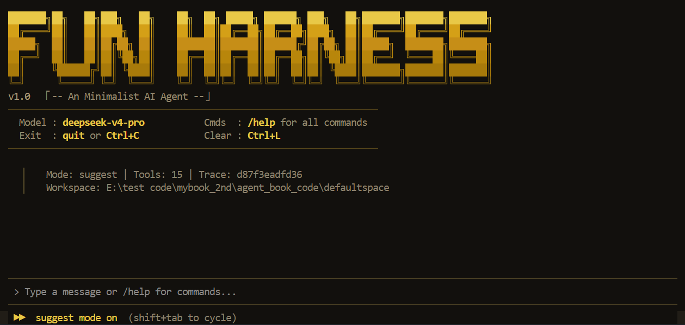

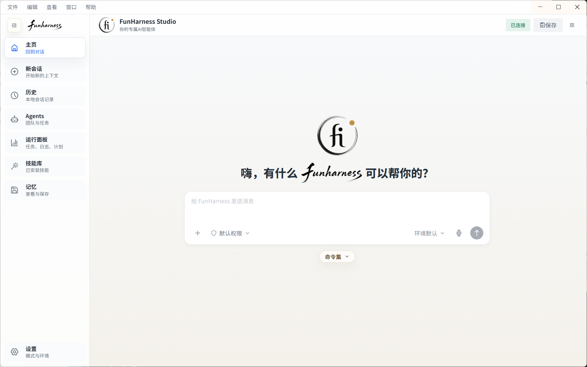

</div>

<br/>

<div align="center">

|                          TUI 工具调用过程                          |                          TUI 任务执行状态                          |
| :----------------------------------------------------------------: | :----------------------------------------------------------------: |
|    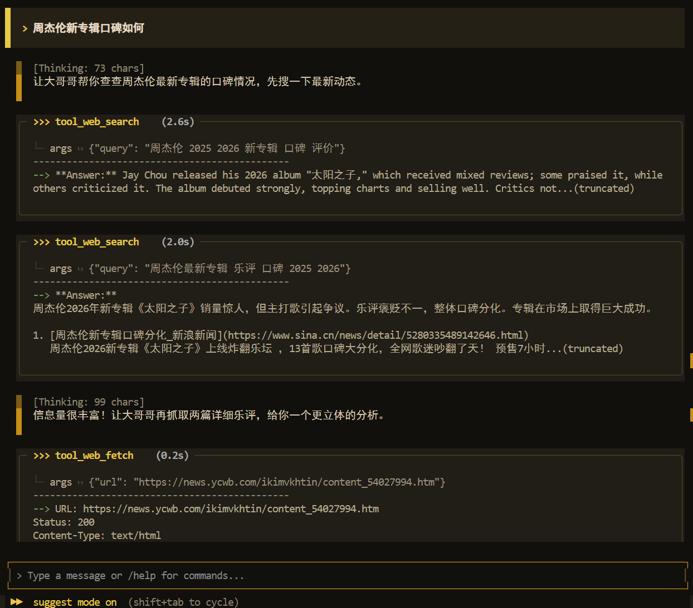   |    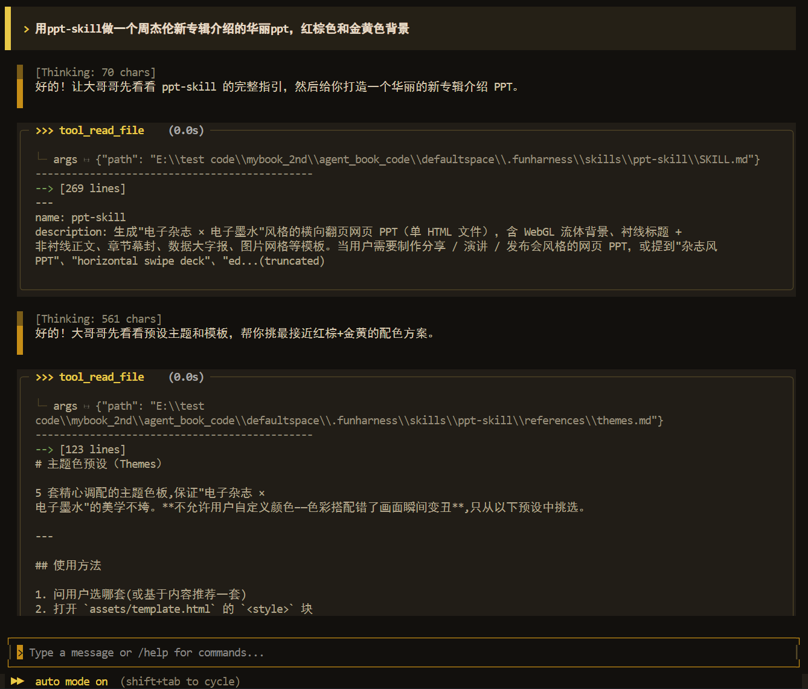   |
|                        Studio 主界面                        |                      Studio Agent Teams                       |
|   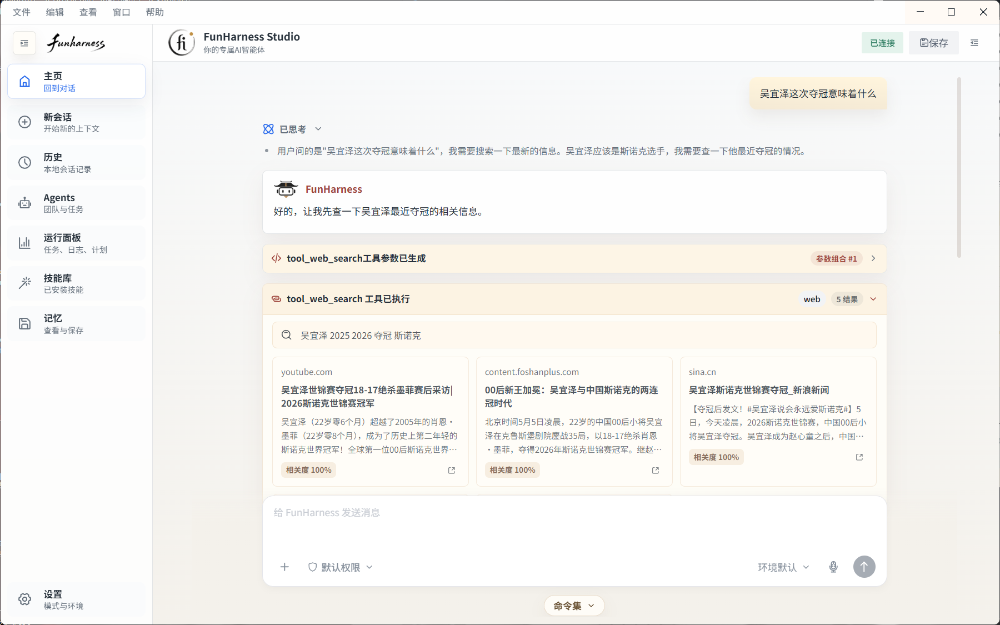   |   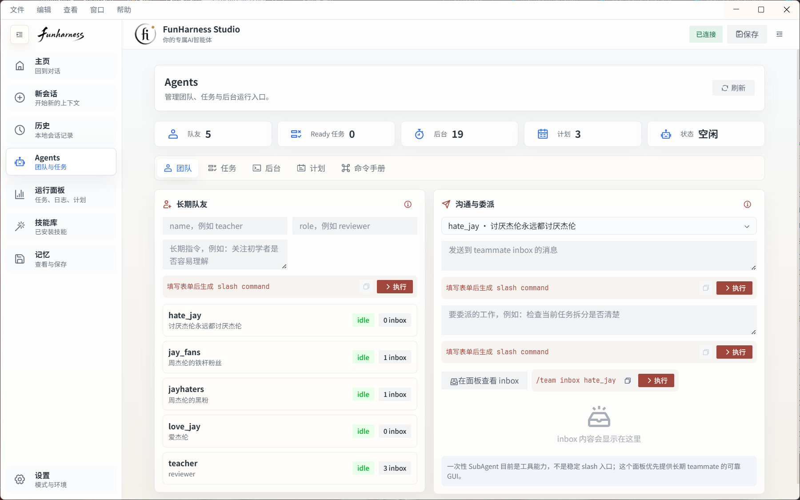 |

</div>

---

### 命令参考

在 TUI 输入框中可以输入斜杠命令，也可以使用快捷指令控制当前会话。

<details>
<summary>展开斜杠命令参考</summary>

| 斜杠命令                                                    | 说明                                             |
| ----------------------------------------------------------- | ------------------------------------------------ |
| `/help`                                                     | 显示所有可用命令                                 |
| `/new`                                                      | 开始新会话（自动保存当前会话）                   |
| `/cost`                                                     | 显示当前 Token 用量与估算费用                    |
| `/context`                                                  | 显示上下文窗口状态（tokens / 消息数）            |
| `/save`                                                     | 手动保存当前会话                                 |
| `/memory`                                                   | 查看持久记忆内容                                 |
| `/attach <path1> [path2 ...]`                               | 添加一个或多个会话附件                           |
| `/attachments`                                              | 查看当前会话附件与预览                           |
| `/detach <id\|all>`                                         | 移除附件引用                                     |
| `/mode [auto\|suggest\|approve]`                            | 查看或切换权限模式                               |
| `/perms`                                                    | 查看路径权限配置                                 |
| `/skills`                                                   | 列出已发现的 Skills 及摘要                       |
| `/hooks`                                                    | 列出已注册的 Hooks                               |
| `/middleware`                                               | 列出中间件链                                     |
| `/plan <需求描述>`                                          | 生成 JSON 任务列表并保存                         |
| `/task create <标题>`                                       | 手动创建一条持久任务                             |
| `/task get <T1>`                                            | 查看单条任务的完整 JSON 状态                     |
| `/task update <T1> status=<状态> owner=<成员> notes=<备注>` | 更新任务状态、负责人或备注                       |
| `/tasks`                                                    | 查看当前任务列表与完成进度                       |
| `/next`                                                     | 获取下一个待执行任务详情                         |
| `/done <T1> [files]`                                        | 标记任务完成并记录产出文件                       |
| `/progress`                                                 | 查看进度追踪文件                                 |
| `/team`                                                     | 查看当前 Agent Team 名册                         |
| `/team create <name> <role> [instructions]`                 | 创建或更新一个长期队友                           |
| `/team inbox <name>`                                        | 查看队友 inbox                                   |
| `/team send <name> <message>`                               | 给队友 inbox 发送消息                            |
| `/delegate <name> <任务描述>`                               | 将工作异步委派给某个队友                         |
| `/bg`                                                       | 查看后台 runtime task 状态                       |
| `/bg run <command>`                                         | 在后台运行慢命令，主循环可继续工作               |
| `/bg status <runtime_id>`                                   | 查看后台任务 JSON 状态                           |
| `/bg output <runtime_id>`                                   | 查看后台任务完整输出                             |
| `/schedule`                                                 | 查看定时调度列表                                 |
| `/schedule create <name> <when> <prompt>`                   | 创建定时 prompt，例如 `in 10m` 或 `*/5 * * * *`  |
| `/schedule run <job_id>`                                    | 立即触发一次调度任务                             |
| `/schedule delete <job_id>`                                 | 删除调度记录                                     |
| `/events`                                                   | 手动拉取 runtime / schedule 事件                 |
| `/trace`                                                    | 显示 Span 追踪时间线与汇总                       |
| `/logs`                                                     | 显示最近 15 条结构化日志                         |
| `/dashboard`                                                | 显示成本与 Token 看板                            |
| `/failures`                                                 | 分析失败模式（循环/错误/重复调用）               |
| `/export`                                                   | 导出追踪、日志和成本数据到 `.funharness/traces/` |

</details>

#### 快捷指令

| 快捷指令            | 说明                           |
| ------------------- | ------------------------------ |
| `Shift+Tab`         | 循环切换权限模式               |
| `clear` 或 `Ctrl+L` | 清空对话（保存当前会话后重置） |
| `Ctrl+Z`            | 中断当前会话                   |
| `quit` 或 `Ctrl+C`  | 退出 FunHarness                |

#### 示例：用 Agent Team 完成一个小练习

**给学生演示如何做一个待办清单 CLI 小项目**。你可以把下面几行直接输入到 FunHarness 的 TUI 里，观察任务如何被拆分、委派、后台执行和定时提醒。

```text
# 第 1 步：让主 Agent 先把练习拆成可执行任务
/plan 做一个 todo.py 命令行工具，支持添加待办、列出待办、标记完成，并补充简单测试

# 第 2 步：查看任务板。读者可以看到每个任务的编号、状态和负责人
/tasks

# 第 3 步：创建一个“代码助教”，专门检查代码是否容易讲清楚
/team create teacher 教学助教 关注代码是否适合初学者理解，指出命名、结构和注释是否清楚

# 第 4 步：把审查工作交给这个助教。主 Agent 仍然可以继续和你对话
/delegate teacher 检查当前 todo.py 练习方案是否适合课堂讲解，并给出改进建议

# 第 5 步：查看后台任务。委派给队友的工作会显示在这里
/bg

# 第 6 步：手动拉取完成事件，看看队友是否已经给出反馈
/events

# 第 7 步：如果项目里有测试，可以把测试放到后台跑
/bg run pytest -q

# 第 8 步：再次查看后台列表。复制其中显示的运行编号，再看完整输出
/bg
# 下面的 run_ab12cd34 是示例编号；实际使用时换成 /bg 里显示的编号
/bg output run_ab12cd34

# 第 9 步：安排一个提醒。10 分钟后，FunHarness 会提醒你回头检查测试和队友反馈
/schedule create 课后检查 in 10m 检查 todo.py 的测试结果和教学助教反馈
/schedule
```

这组命令背后的含义可以这样理解：

- **`/plan` 和 `/tasks`**：把一个模糊目标变成任务板，适合教学时展示“Agent 如何拆任务”。
- **`/team create` 和 `/delegate`**：创建一个有明确职责的队友，再把某件事交给它异步处理。
- **`/bg run` 和 `/bg output`**：把测试、构建这类耗时命令放到后台，不阻塞当前对话。
- **`/schedule create`**：给未来某个时间点安排提醒或复查，适合课堂演示“Agent 可以持续跟进任务”。

只需要先记住一个顺序：**先 `/plan` 拆任务，再 `/team create` 建队友，然后 `/delegate` 分工，最后用 `/bg` 和 `/schedule` 跟踪执行情况**。

<div align="center"></div>

## IM 机器人通道

[](./docs/feishu_channel.zh.md) [](#) [](#) [](#)

FunHarness 支持通过 **IM 机器人** 作为输入通道：用户在聊天软件中发消息，本地 FunHarness 运行 Agent 并回复结果。同一套 Agent Core 可以同时接入 TUI、GUI 和任意 IM 通道。

```
IM 消息 -> 通道网关（长连接/WebSocket/长轮询） -> 本地 FunHarness -> Agent Loop + Tools -> 回复 IM
```

| 通道 | 接入方式 | 消息类型 | 启动命令 | 需要公网 |
|------|---------|---------|---------|:-------:|
| **飞书** | 长连接 (WebSocket via lark-oapi) | 文本 | `uv run fh feishu` | 否 |
| **QQ** | WebSocket 网关 (qqbot-agent-sdk) | 文本 + 文件收发 | `uv run fh qqbot` | 否 |
| **微信** | getUpdates 长轮询 (ilinkai API) | 文本 | `uv run fh weixin` | 否 |

---

### 飞书机器人

在飞书开放平台创建自建应用，开启机器人能力。详细配置见 [飞书通道文档](./docs/feishu_channel.zh.md)。


```bash
# .env 配置
FEISHU_APP_ID=cli_xxx
FEISHU_APP_SECRET=xxx
FEISHU_EVENT_MODE=ws

# 启动
uv run fh feishu
```

---

### QQ 机器人

在 [QQ 开放平台](https://q.qq.com/) 创建机器人应用，获取 App ID 和 Client Secret。支持 C2C 私聊和群聊消息，并可自动接收和发送文件（图片、文档、音视频）。

```bash
# .env 配置
QQ_APP_ID=your_qq_app_id
QQ_CLIENT_SECRET=your_qq_client_secret
QQ_PERMISSION_MODE=suggest

# 启动
uv run fh qqbot
```

| 配置项 | 说明 |
|--------|------|
| `QQ_APP_ID` | QQ 开放平台机器人 App ID |
| `QQ_CLIENT_SECRET` | 机器人 Client Secret |
| `QQ_PERMISSION_MODE` | `suggest`（推荐）或 `auto` |

---

### 微信机器人

微信通道基于 [openclaw-weixin](https://github.com/Tencent/openclaw-weixin) 的后端 API 协议实现。首次使用需要扫码登录，之后凭证会自动保存。

```bash
# 第一步：扫码登录（终端会显示二维码）
uv run fh weixin-login

# 第二步：启动微信网关
uv run fh weixin
```

| 配置项 | 说明 |
|--------|------|
| `WEIXIN_PERMISSION_MODE` | `suggest`（推荐）或 `auto` |
| `WEIXIN_WORKSPACE` | Agent 工作目录（可选） |

登录凭证保存在 `.funharness/weixin_credentials.json`，后续启动无需重新扫码。

---

### 通用说明

三个 IM 通道都支持在聊天窗口直接输入斜杠命令控制当前会话：

| 命令 | 飞书 | QQ | 微信 | 说明 |
|------|:----:|:--:|:----:|------|
| `/help` | ✓ | ✓ | ✓ | 查看当前通道支持的命令 |
| `/new` | ✓ | ✓ | ✓ | 开启一个新的 FunHarness 会话，旧会话会先保存 |
| `/restart` / `/reset` | ✓ | ✓ | ✓ | `/new` 的别名 |
| `/重新开始` / `重新开始` | ✓ | ✓ | ✓ | 中文“重新开始”别名 |
| `/interrupt` | ✓ | ✓ | ✓ | 中断当前正在执行的 Agent 任务 |
| `stop` / `interrupt` | ✓ | ✓ | ✓ | `/interrupt` 的文本别名 |
| `/files` | - | ✓ | ✓ | 查看当前会话已注册的附件 |

> `/new` 只会重置当前聊天对象对应的 session：飞书按 `chat_id`，QQ 按私聊/群聊作用域，微信按 `user_id` 隔离，不会影响其他用户或其他群聊。

### 各频道运行截图

<div align="center">

|                      飞书                      |                     QQ                      |                      微信                      |
| :--------------------------------------------: | :-----------------------------------------: | :--------------------------------------------: |
| 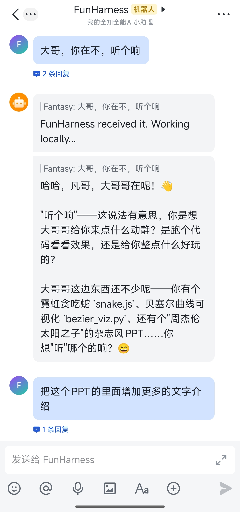 |  | 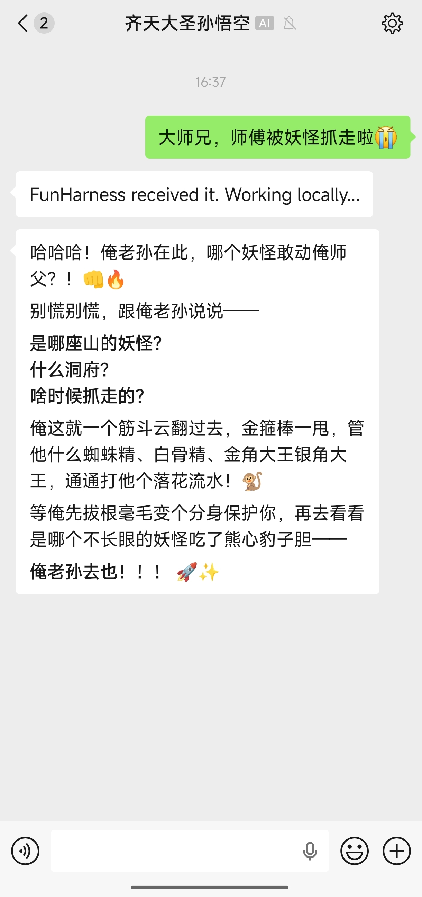 |

</div>


> **当前限制**：IM 通道的 `suggest` 模式下高风险操作会被拒绝（暂不支持远程交互式审批）。如需自动执行，可设置 `*_PERMISSION_MODE=auto`，仅在受信任的工作区使用。

<div align="center"></div>

## 依赖说明

| 依赖              | 版本     | 用途                                       |
| ----------------- | -------- | ------------------------------------------ |
| `openai`          | >=2.32.0 | LLM API 调用（兼容任意 OpenAI 格式服务商） |
| `textual[syntax]` | >=8.2.4  | TUI 界面框架                               |
| `lark-oapi`       | >=1.4.23 | 飞书机器人 SDK                             |
| `qqbot-agent-sdk` | >=1.2.2  | QQ 机器人 SDK（WebSocket + REST API）      |
| `qrcode`          | >=8.0    | 微信扫码登录终端二维码显示                 |
| `python-dotenv`   | >=1.2.2  | `.env` 配置加载                            |


所有依赖通过 `uv sync` 自动安装，无需手动 pip install。

---

## 许可证

本项目采用 [MIT License](./LICENSE) 开源协议。

---

## 致谢

本书与 FunHarness 项目在设计上参考了以下优秀开源项目，特此致谢：

- [learn-claude-code](https://github.com/shareAI-lab/learn-claude-code) — Claude Code 学习资源，启发了本书的工具系统设计
- [OpenHarness](https://github.com/HKUDS/OpenHarness) — FunHarness 的命名与架构灵感来源
- [hermes agent](https://github.com/nousresearch/hermes-agent) — 多 Agent 协作模式的参考实现
- [Pi coding-agent](https://github.com/badlogic/pi-mono/tree/main/packages/coding-agent) —  agent 工程实现的重要参考来源

---

<div align="center">

**如果这本书或这个项目对你有帮助，欢迎点个 Star**

<a href="https://github.com/hyyhf/agent-book-code"></a>

*Made with love for everyone who wants to understand AI agents from the ground up.*

</div>
