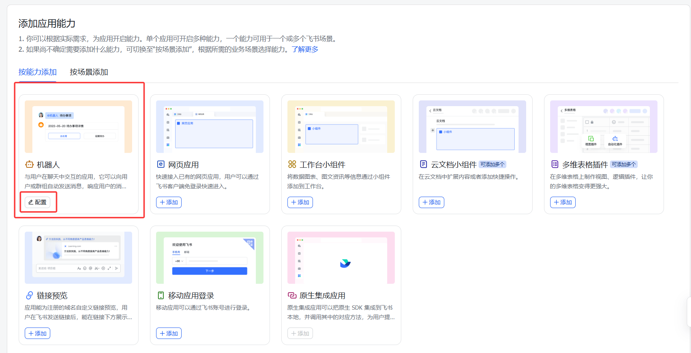
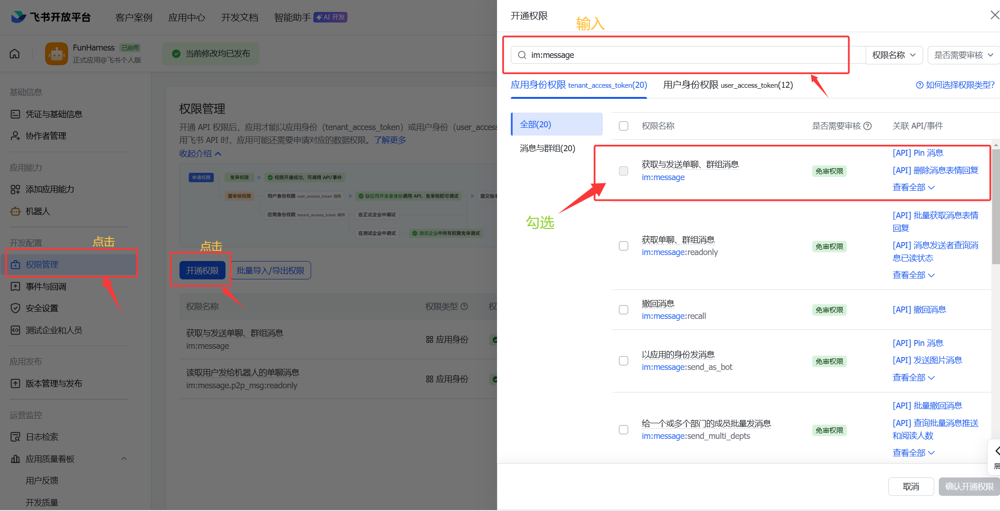
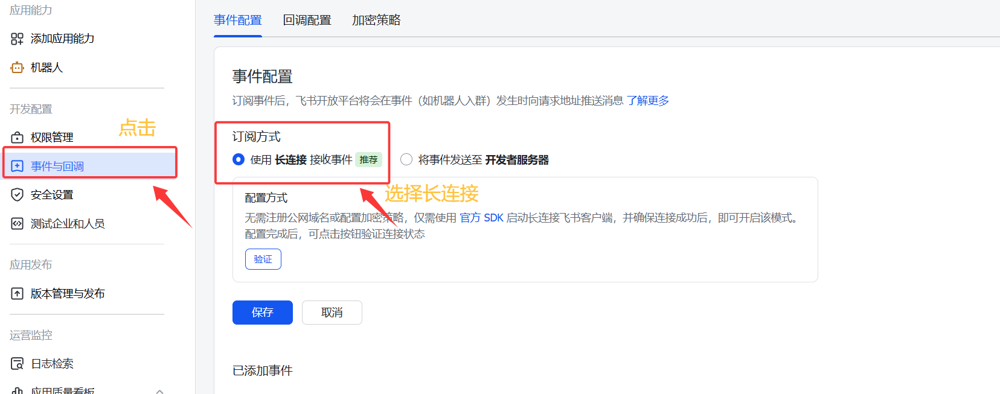
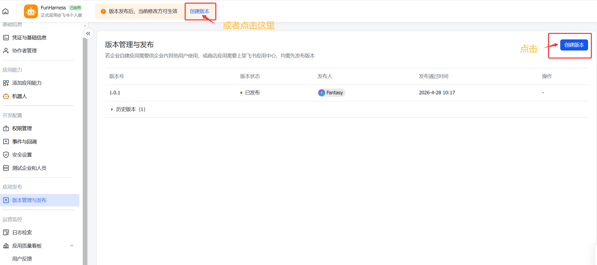
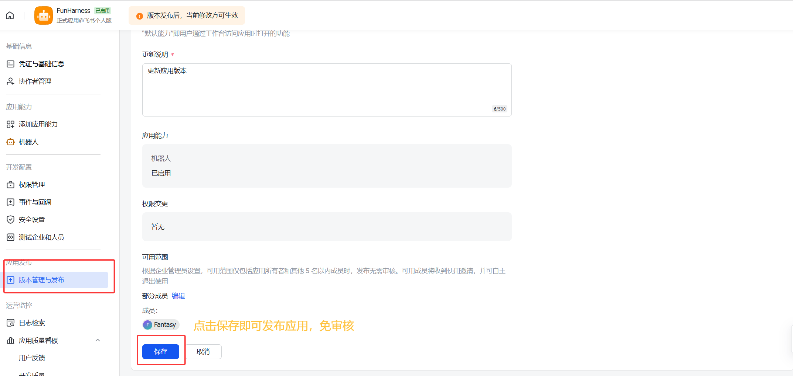

# FunHarness 飞书机器人通道配置指南

本文档说明如何把 FunHarness 接入飞书机器人：用户在飞书里给机器人发消息，FunHarness 在本地运行 agent、调用本地工具，然后把状态、工具调用结果和最终回复发送回飞书。

FunHarness 当前推荐使用飞书的 **长连接** 模式。长连接模式下，本地程序主动连接飞书开放平台接收事件，因此 **不需要公网地址**，也不需要 ngrok、frp、Cloudflare Tunnel 之类的内网穿透。

## 一、准备工作

你需要先准备：

- 一个飞书开放平台自建应用
- 这个项目的 `.env` 文件
- 本地能运行 FunHarness 的 Python/uv 环境
- 飞书应用的 `App ID` 和 `App Secret`

项目根目录是：

```text
E:\test code\mybook_2nd\agent_book_code
```

`.env` 文件建议放在项目根目录：

```text
E:\test code\mybook_2nd\agent_book_code\.env
```

## 二、在飞书应用里开启机器人能力

进入飞书开放平台的应用后台，左侧点击 **添加应用能力**，找到 **机器人**，点击 **配置** 或添加机器人能力。



机器人能力开启后，飞书用户才能在聊天里和这个应用交互。

## 三、开通消息相关权限

左侧点击 **权限管理**，然后点击 **开通权限**。

在弹出的权限窗口中，保持在：

```text
应用身份权限 tenant_access_token
```

不要切到“用户身份权限”。FunHarness 机器人收发消息使用的是应用身份。

在搜索框里输入：

```text
im:message
```

建议至少勾选下面这些消息相关权限：

```text
获取与发送单聊、群组消息
im:message
```

如果你的飞书后台权限拆得更细，也请同时开通：

```text
以应用的身份发消息
im:message:send_as_bot
```

以及接收消息事件相关权限：

```text
im.message.receive_v1
```

截图里红框标出的就是权限管理入口、搜索框，以及需要勾选的消息权限。



开通后点击右下角的 **确认开通权限**。

> 注意：权限开通以后，通常还需要创建并发布一个应用版本，权限修改才会真正生效。

## 四、配置事件订阅：选择长连接

左侧点击 **事件与回调**，进入 **事件配置** 页面。

订阅方式选择：

```text
使用长连接接收事件
```

不要选择：

```text
将事件发送至开发者服务器
```

“开发者服务器”模式才需要公网回调地址；我们这里使用长连接，所以不需要公网地址。



然后点击页面里的 **添加事件**，添加：

```text
im.message.receive_v1
```

这个事件表示：当用户给机器人发消息，或群里 @ 机器人时，飞书会把消息事件通过长连接推送给本地 FunHarness。

## 五、创建并发布应用版本

飞书应用里，权限、机器人能力、事件订阅等修改通常要发布版本后才会生效。

左侧点击 **版本管理与发布**，然后点击 **创建版本**。



进入创建版本页面后，填写更新说明，例如：

```text
更新应用版本
```

确认应用能力里包含机器人，权限变更符合预期，然后点击底部 **保存**。



如果你的应用是企业自建应用，并且页面提示“发布无需审核”或“免审核”，保存后即可生效。如果企业管理员策略要求审核，则按飞书页面提示提交审核。

## 六、配置本地 `.env`

在飞书开放平台左侧点击 **凭证与基础信息**，复制：

- `App ID`
- `App Secret`

然后写入项目根目录的 `.env`：

```bash
OPENAI_API_KEY=你的模型 API Key
OPENAI_MODEL_NAME=deepseek-v4-flash

FEISHU_APP_ID=cli_xxx
FEISHU_APP_SECRET=xxx
FEISHU_EVENT_MODE=ws
FEISHU_PERMISSION_MODE=suggest
```

字段说明：

| 配置项 | 是否必填 | 说明 |
| --- | --- | --- |
| `FEISHU_APP_ID` | 必填 | 飞书应用的 App ID，通常以 `cli_` 开头 |
| `FEISHU_APP_SECRET` | 必填 | 飞书应用的 App Secret |
| `FEISHU_EVENT_MODE` | 推荐填写 | `ws` 表示长连接模式，不需要公网地址 |
| `FEISHU_PERMISSION_MODE` | 推荐填写 | 建议先用 `suggest`，更安全 |
| `OPENAI_API_KEY` | 必填 | FunHarness 调用模型需要 |
| `OPENAI_MODEL_NAME` | 推荐填写 | 例如 `deepseek-v4-flash` |

可选配置：

```bash
FEISHU_API_BASE=https://open.feishu.cn/open-apis
FEISHU_WORKSPACE=defaultspace
```

如果使用 Lark 国际版，可以改成：

```bash
FEISHU_API_BASE=https://open.larksuite.com/open-apis
```

## 七、启动 FunHarness 飞书通道

推荐启动方式：

```powershell
uv run fh feishu
```

如果第一次运行后提示没有安装入口脚本，先执行：

```powershell
uv sync
```

然后再次运行：

```powershell
uv run fh feishu
```

启动成功后，终端会看到类似输出：

```text
FunHarness Feishu gateway starting in long connection mode.
Keep this process running, then click Verify/Save in Feishu.
```

保持这个终端不要关闭。关闭后，飞书机器人就无法把消息转发到本地 FunHarness。

## 八、回到飞书页面验证长连接

本地已经启动 `uv run fh feishu` 后，回到飞书开放平台的 **事件与回调** 页面。

在“使用长连接接收事件”区域点击：

```text
验证
```

验证通过后点击：

```text
保存
```

如果验证失败，优先检查：

- 本地 `uv run fh feishu` 是否仍在运行
- `.env` 里的 `FEISHU_APP_ID` 是否正确
- `.env` 里的 `FEISHU_APP_SECRET` 是否正确
- 飞书应用是否已经开通机器人能力
- 是否添加了 `im.message.receive_v1` 事件
- 权限修改后是否已经创建并发布版本

## 九、在飞书里使用

### 私聊机器人

在飞书里找到你的机器人，直接发消息：

```text
帮我查看当前项目结构
```

FunHarness 会在本地执行，然后把状态、工具调用和最终结果发回飞书。


### 常用命令

查看帮助：

```text
/help
```

中断当前任务：

```text
/interrupt
```

## 十、权限模式怎么选

默认推荐：

```bash
FEISHU_PERMISSION_MODE=suggest
```

这个模式下，读文件、搜索、网页访问等低风险工具可以执行；写文件、执行 shell 命令等高风险操作需要审批。

由于飞书通道目前还没有实现远程交互式审批，所以在 `suggest` 模式下，遇到需要审批的工具会被拒绝。

如果你明确信任当前工作区，并希望飞书机器人可以写文件、执行命令，可以设置：

```bash
FEISHU_PERMISSION_MODE=auto
```

然后重启：

```powershell
uv run fh feishu
```

请只在你确认安全的本地工作区里使用 `auto`。

## 十一、常见问题

### 1. 我没有公网地址怎么办？

选择 **使用长连接接收事件**，不需要公网地址。

不要选择“将事件发送至开发者服务器”。那个模式才需要公网地址。

### 2. `uv run fh feishu` 找不到 `fh`

先执行：

```powershell
uv sync
```

然后再运行：

```powershell
uv run fh feishu
```

### 3. `fh feishu` 可以吗？

可以，但前提是你的当前环境已经安装了项目的 console script。可以先在命令行中执行：
```powershell
.\.venv\Scripts\activate
```
然后执行`fh feishu`即可。

但更推荐：

```powershell
uv run fh feishu
```

这样 uv 会自动使用项目虚拟环境。

### 4. uv 缓存目录报权限错误怎么办？

如果你看到类似：

```text
Failed to initialize cache at E:\Developer\cachedir
Permission denied
```

说明 uv 的默认缓存目录或 `UV_CACHE_DIR` 环境变量指向了一个你没有权限的位置。

可以检查：

```powershell
uv cache dir
```

如果需要清理：

```powershell
uv cache clean
```

如果是环境变量导致的，可以在当前 PowerShell 临时删除：

```powershell
Remove-Item Env:UV_CACHE_DIR
```

然后再运行：

```powershell
uv run fh feishu
```

### 5. 飞书里发消息没有反应

按下面顺序检查：

1. 本地 `uv run fh feishu` 是否还在运行
2. 飞书机器人是否已经添加到私聊或群聊
3. 群聊里是否 @ 了机器人
4. 是否添加事件 `im.message.receive_v1`
5. 是否开通了消息权限
6. 是否创建并发布了应用版本
7. `.env` 里的 `FEISHU_APP_ID` / `FEISHU_APP_SECRET` 是否正确

### 6. 机器人能读文件但不能写文件

这是权限模式导致的。

如果 `.env` 是：

```bash
FEISHU_PERMISSION_MODE=suggest
```

写文件、执行 shell 命令等高风险工具会被拒绝。

如果你确认安全，可以改成：

```bash
FEISHU_PERMISSION_MODE=auto
```

然后重启服务。

## 十二、当前限制

- 当前只处理文本消息。
- 当前使用长连接模式，不需要公网地址。
- 暂不支持飞书 encrypted callback。
- 暂不支持飞书侧远程交互式 approval。
- 网络请求类工具如果正在阻塞等待响应，需要等 timeout 后才能完全停止。
- shell 命令类工具可以被 `/interrupt` 中断。
