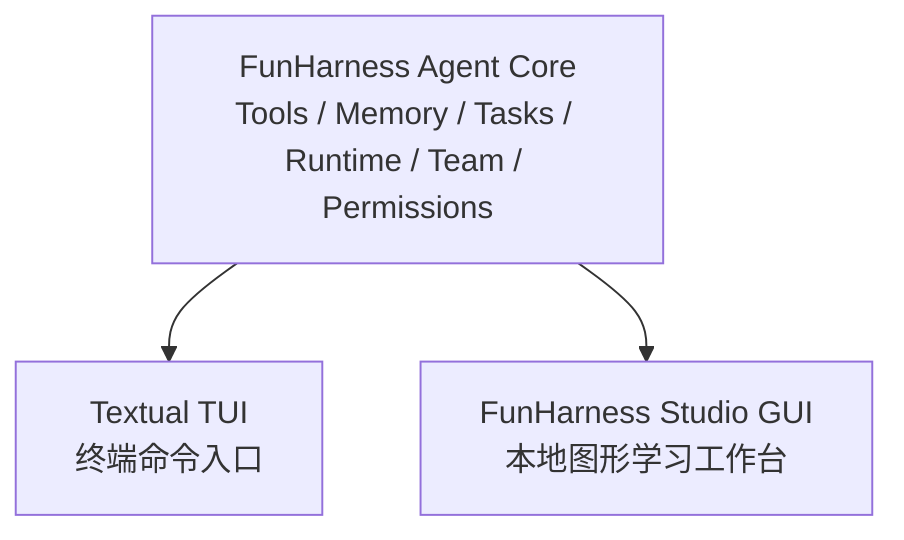
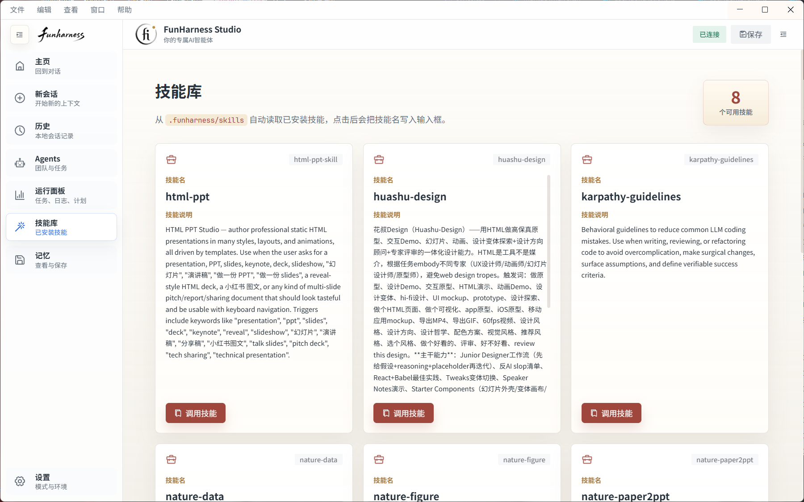
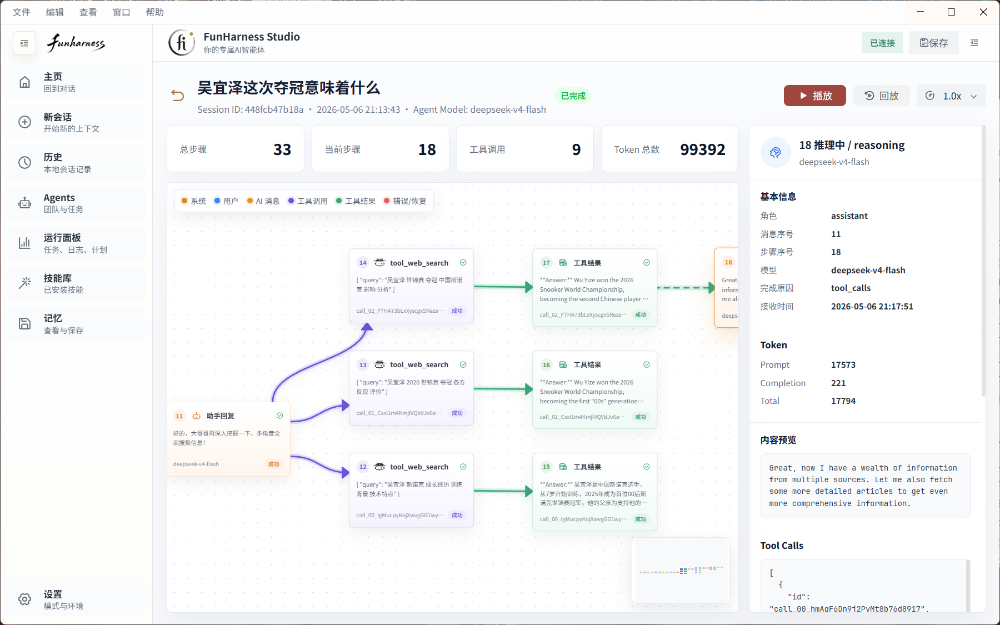
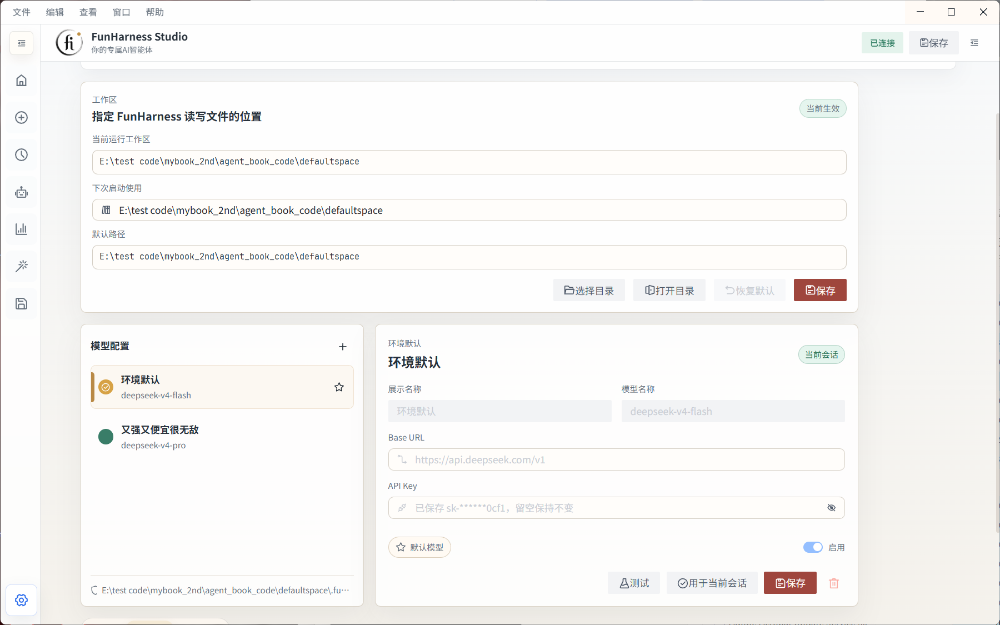

# FunHarness Studio 介绍

FunHarness Studio 是 FunHarness 的本地化图形界面(GUI)版本，也可以理解为面向学生和课堂场景打造的 **Agent GUI 学习工作台**。它不是另起炉灶的新 Agent，而是复用 FunHarness 已经实现好的 Agent Core，把 TUI 里的对话、工具调用、任务规划、后台运行、团队协作、附件、会话和可观测性能力，组织成更直观、更容易上手的桌面体验。

如果说 TUI 更适合展示“一个 Agent 在终端里如何通过命令工作”，那么 FunHarness Studio 更适合展示“一个本地 Agent 产品如何被普通学习者使用”。学生不需要一开始记住大量斜杠命令，也不需要理解所有内部文件结构，就可以通过按钮、面板、表单和可视化状态进入 Agent 实验。

## 项目目的

FunHarness Studio 的目标不是做一个复杂的商业 IDE，而是服务本书的教学目标：让学生在本地电脑上真正跑起来一个可观察、可拆解、可改造的 AI Agent。

它主要解决三个教学问题：

- **降低上手门槛**：TUI 对开发者很友好，但初学者第一次接触 Agent 时，可能会被命令、参数、工作区路径和状态文件分散注意力。Studio 把常用操作放到图形界面里，让学生先看到结果，再逐步理解背后的命令。
- **增强过程可见性**：Agent 的关键不只是“回答了什么”，还包括“为什么调用工具”“工具参数是什么”“任务如何拆解”“后台任务是否完成”。Studio 把这些过程变成可观察的消息卡片、面板和历史回放。
- **适合课堂演示**：教师可以直接在投影中展示对话、工具调用、任务板、团队协作、会话回放和配置变化。学生能跟着界面同步操作，也能在课后复现实验。

## 与 TUI 的关系

FunHarness Studio 与 TUI 是并列的两个交互入口，它们共享同一个 FunHarness Agent Core。

TUI 的价值在于简洁、透明、贴近底层。它适合讲解斜杠命令、权限模式、工具调用流和 Agent Loop 的运行方式。Studio 的价值在于友好、可视化、适合学生群体。它把同样的能力包装成图形界面，帮助学生通过点击、选择和观察来理解 Agent 系统。

因此二者不是替代关系，而是互补关系：教师可以先用 Studio 带学生建立直觉，再切到 TUI 讲解命令和实现；也可以先从 TUI 解释机制，再用 Studio 展示这些机制如何组成一个本地 Agent 产品。

## 技术组成

FunHarness Studio 由三部分组成：

| 部分 | 说明 |
| --- | --- |
| **FastAPI Backend** | 位于 `funGUI/backend/`，负责连接 `FunHarnessAgent`，提供聊天、斜杠命令、会话、附件、工作区、模型配置等 API。 |
| **Vite + React Frontend** | 位于 `funGUI/src/`，负责桌面界面、消息卡片、面板、文件预览、命令表单和会话回放。 |
| **Electron Shell** | 位于 `funGUI/electron/`，负责本地桌面应用外壳，并可自动启动后端服务。 |

这套结构刻意保持清晰：后端仍然是 FunHarness 的 Python Agent 能力，前端只是把这些能力以教学友好的方式呈现出来。

## 主要功能

### 1. 对话与工具调用可视化

Studio 的主界面保留了 ChatGPT/Claude 类产品中最熟悉的对话体验，但它更强调本地 Agent 的执行过程。用户发送需求后，可以在消息流里看到 Agent 的思考状态、工具调用、命令输出和最终回复。

对教学来说，这一点很重要：学生可以观察到 Agent 并不是“凭空回答”，而是在必要时读取文件、运行命令、搜索信息、拆解任务，并把结果反馈给下一轮推理。

主界面还提供命令集入口，常用斜杠命令可以直接点击触发，降低记忆成本。

### 2. 本地工作区与附件管理

Studio 面向本地实验，因此它把工作区文件、会话附件和预览能力放到了界面中。学生可以在 GUI 中查看本地项目文件，也可以上传文档作为当前会话上下文。

附件能力适合教学中的材料分析场景，例如：

- 给 Agent 上传一份课程讲义，让它提取重点。
- 上传需求文档，让它拆成任务列表。
- 上传表格或文档，让它生成摘要、检查问题或辅助写报告。

这些操作背后仍然落到 `.funharness/uploads/` 和当前会话状态里，方便教师继续讲解“Agent 如何管理本地上下文”。

### 3. Skills 面板

Skills 是 FunHarness 中非常适合教学的机制：它展示了如何通过一个 `SKILL.md` 文件扩展 Agent 的行为。Studio 提供了 Skills 面板，让学生能直观看到当前有哪些技能、技能的说明是什么，并快速把技能用于当前对话。

教师可以用这个面板讲解：

- 什么是 Skill。
- Skill 与系统提示词的关系。
- 如何通过 Markdown 文件扩展 Agent。
- 为什么技能系统比把所有提示词写死在代码里更容易维护。

### 4. Agent Teams 与任务表单

FunHarness 支持 Agent Team：可以创建长期队友，把任务异步委派给不同角色。TUI 中这些能力通过 `/team`、`/delegate`、`/plan`、`/task`、`/bg` 等命令完成；Studio 则把它们整理成表单和面板。

这对学生特别友好。学生不需要一开始记住完整命令格式，可以先填写“队友名称、角色、任务描述”等字段，由界面生成对应命令并执行。等理解流程后，再回到 TUI 学习命令本身。

适合课堂演示的例子包括：

- 创建“代码审查员”，让它专门检查实现质量。
- 创建“测试助教”，让它关注测试覆盖和边界条件。
- 创建“教学助教”，让它判断代码是否适合初学者理解。
- 把一个项目需求拆成任务图，再分配给不同队友。

### 5. 后台运行与调度面板

Agent 系统里有很多操作不应该阻塞当前对话，例如运行测试、执行构建、等待定时检查、委派队友异步处理。FunHarness 的 Runtime 和 Schedule 能力就是为此设计的。

Studio 把这些后台任务展示成可观察的面板：学生可以看到任务 ID、执行状态、输出结果和调度记录。这样教师在讲解“长任务为什么要进入后台”“Agent 如何持续跟进任务”时，不需要只靠命令行输出说明。

### 6. 会话历史与回放

会话回放是 Studio 很适合教学的一项特色功能。它不是简单列出历史对话，而是把一次 Agent 会话重新组织成可阅读、可复盘的过程。

学生可以回看：

- 当时提出了什么需求。
- Agent 如何一步步回复。
- 哪些工具被调用。
- 工具结果如何影响后续回答。
- 一次任务为什么成功或失败。

这很适合作为课后复盘材料，也适合教师在课堂上讲解一次完整 Agent 工作流。

### 7. 模型与运行设置

Studio 提供设置面板，用于管理模型配置、后端连接、工作区信息和运行模式。对学生来说，这比直接修改 `.env` 更容易理解；对教师来说，也更方便统一演示不同模型配置对 Agent 行为的影响。

设置面板尤其适合讲解：

- OpenAI-compatible 模型配置。
- 当前后端服务地址。
- 权限模式与本地运行边界。
- 为什么本地 Agent 必须关心工作区和安全策略。

## 适合教学的特色功能

FunHarness Studio 的很多设计都服务于课堂和学生练习：

| 教学场景 | Studio 如何帮助 |
| --- | --- |
| 第一次体验 Agent | 提供熟悉的聊天界面和按钮式操作，学生可以先使用，再学习命令。 |
| 讲解工具调用 | 工具调用以卡片形式出现，方便展示参数、状态和结果。 |
| 讲解任务规划 | Agent Teams 面板可以把 `/plan`、`/task`、`/delegate` 等命令转成表单。 |
| 讲解后台任务 | Runtime 面板展示后台命令、调度任务和输出结果。 |
| 讲解上下文材料 | 附件功能让学生把文档、表格、代码文件交给 Agent 分析。 |
| 讲解技能系统 | Skills 面板把 `SKILL.md` 这种可扩展机制可视化。 |
| 课后复盘 | Session Replay 可以回放一次完整会话，适合写实验报告和复盘 Agent 行为。 |

这些功能共同构成了一个非常适合教学的本地化 Agent GUI：它既足够容易上手，又没有把底层机制完全藏起来。学生可以先通过界面建立直觉，再进入代码和 TUI 理解实现。

## 小结

FunHarness Studio 的定位很明确：它是 FunHarness 的本地 GUI 版本，也是面向学生和教学场景的 Agent 学习工作台。它与 TUI 共用一套核心能力，但用更直观的方式呈现 Agent 的运行过程。

在课程中，可以把 TUI 用作“机制讲解入口”，把 Studio 用作“产品化体验入口”。二者结合起来，学生既能知道 Agent 怎么用，也能逐步理解 Agent 为什么能这样工作。
